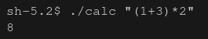

# eval_expr project :desktop_computer:

## Done by Maxime and Edouard - Epitech 2021 :mortar_board:

### Overview

This project is a part of the **first** year of Epitech.<br>
We had **1 week** to complete it. :spiral_calendar:<br>

The goal of this project was to create a **calculator** in **C**. :abacus:<br>

### Running the project locally

* Clone this repository locally
* Run `make` in your bash / command line
* Run `./calc <operation>`

> **Warning**
> The only characters allowed in \<operation> are: `1234567890+-*/%()` (no spaces)

To try this program, you can to use this **command**: <br>

```bash
make && ./calc "(1+3)*2"
```

An output you can get from this program can be:



Here are the different **tools** and **languages** we used to make this project: :hammer_and_wrench:

[](https://github.com/tandpfun/skill-icons)

Here is the **GitHub** of the person who did the project with me : [Edouard Chang](https://github.com/epidoublehaxe)
