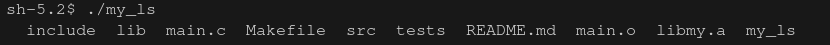

# my_ls project :desktop_computer:

## Done by Maxime - Epitech 2021 :mortar_board:

### Overview

This project is a part of the **first** year of Epitech.<br>
I had **2 weeks** to complete it. :spiral_calendar:<br>

The goal of this project was to recreate a **ls** in **C**. :keyboard:<br>

### Features

* `-l` use a long listing format
* `-R` list subdirectories recursively
* `-d` list directories themselves, not their contents
* `-r` reverse order while sorting
* `-a` do not ignore entries starting with `.`
* `-t` sort by time, newest first

### Running the project locally

* Clone this repository locally
* Run `make` in your bash / command line
* Run `./my_ls`

> **Warning**
> `-t` option is unstable and not reliable.

To try this program, you can to use this **command**: <br>

```bash
make && ./my_ls
```

An output you can get from this program can be:



Here are the different **tools** and **languages** we used to make this project: :hammer_and_wrench:

[](https://github.com/tandpfun/skill-icons)
