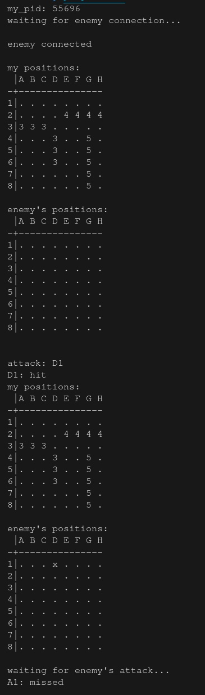
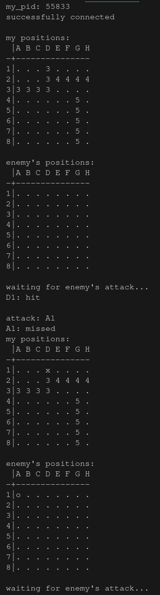

# Navy project :desktop_computer:

## Done by Maxime and Killian - Epitech 2021 :mortar_board:

### Overview

This project is a part of the **first** year of Epitech.<br>
We had **2 weeks** to complete it. :spiral_calendar:<br>

The goal of this project was to create a **Battleship game** in **C**. :ship:<br>

this project is composed of a client and a server

### Features

```txt
USAGE:
        ./navy [first_player_pid] (boat_positions)

DESCRIPTION:
        first_player_pid: only for Player 2: PID of Player 1.
        boat_positions: file that represents the position of each ship.
```

### Running the project locally

* Clone this repository locally
* Run `make` in your bash / command line
* Run `./navy player1.txt`

> **Note**
> if no first_player_pid is provided, the server is started or else the client is started

An output you can get from this program can be:
|SERVER                          |CLIENT                          |
|--------------------------------|--------------------------------|
|||

Here are the different **tools** and **languages** we used to make this project: :hammer_and_wrench:

[](https://github.com/tandpfun/skill-icons)

Here is the **GitHub** of the person who did the project with me : [Killian Lelong](https://github.com/highesttt)
