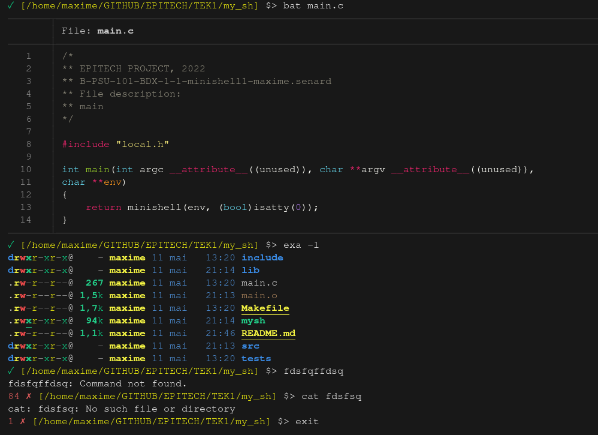

# my_sh project :desktop_computer:

## Done by Maxime - Epitech 2022 :mortar_board:

### Overview

This project is a part of the **first** year of Epitech.<br>
I had **2 weeks** to complete it. :spiral_calendar:<br>

The goal of this project was to create a **shell** that support the tcsh syntax in **C**. :desktop_computer:<br>

### Features

* get executable list from `$PATH` variable
* environement variables with `$<variable name>`
* redirect: `<`, `<<`, `<<<`, `>` and `>>`
* pipes `|` and `&&`
* set and unset varable with `set` and `unset` (like tcsh)
* signals redirect
* interupt with `CTRL-C`
* exit with `CTRL-D`

### Running the project locally

* Clone this repository locally
* Run `make` in your bash / command line
* Run `./my_sh`

To try this program, you can to use this **command**: <br>

```bash
make && ./my_ls
```

An output you can get from this program can be:



Here are the different **tools** and **languages** we used to make this project: :hammer_and_wrench:

[](https://github.com/tandpfun/skill-icons)
