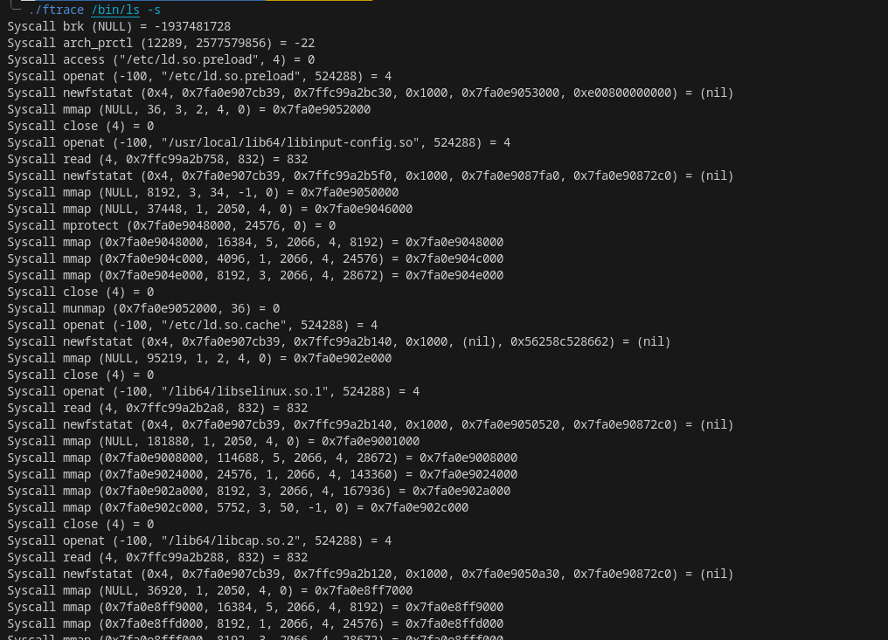

# Ftrace project :desktop_computer:

## Done by Maxime and Melissa - Epitech 2023 :mortar_board:

### Overview

This project is a part of the **second** year of Epitech.<br>
I had **3 weeks** to complete it. :spiral_calendar:<br>

The goal of this project was to be able to trace the execution of a program using **ptrace** function in **C**. :desktop_computer:<br>

### Feature

The project enables you to trace the execution of a program using ptrace function.

The ftrace will display :

* system calls
* a program’s internal function calls with their name and address
* signals received from other programs
* function calls contained in the shared libraries (.so)

If you use `-s` option, the syscall argument and return value will be displayed with their type.

### Running the project locally

* Clone this repository locally
* Run `make` in your bash / command line
* Run `./ftrace <program>` where program is the path to program you want to trace.

To try this program, you can to use this **command**: <br>

```bash
make && ./ftrace /bin/ls -s
```

An output you can get from this program can be:



Here are the different **tools** and **languages** we used to make this project: :hammer_and_wrench:

[](https://github.com/tandpfun/skill-icons)

Here is the **GitHub** of the persons who did the project with me: [Melissa Laget](https://github.com/ackfire)
