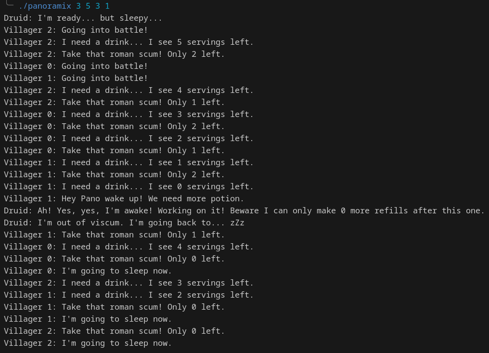

# panoramix project :stew:

## Done by Maxime - Epitech 2023 :mortar_board:

### Overview

This project is a part of the **second** year of Epitech.<br>
I had **2 weeks** to complete it. :spiral_calendar:<br>

The goal of this project was to simulate a battle between Romans and the village of Asterix and Obelix using pthread in **C**. :busts_in_silhouette:<br>

### Running the project locally

* Clone this repository locally
* Run `make` in your bash / command line
* Run `./panoramix <nb_villagers> <pot_size> <nb_fights> <nb_refills>`

To try this program, you can to use this **command**: <br>

```bash
make && ./panoramix 3 5 3 1
```

### Arguments

> **Warning**
> the arguments are really sensitive and any wrong combination will result in a dead-lock

* nb_villagers: indicates the number of villagers (must be >0);
* pot_size: indicates the maximum number that can be contained in the cooking pot (must be >0);
* nb_fights: indicates the maximum number of fights a villager will engage in (must be >0);
* nb_refills: incicates the maximum number of time the druid will refill the pot (must be >0).

An output you can get from this program can be:



Here are the different **tools** and **languages** we used to make this project: :hammer_and_wrench:

[](https://github.com/tandpfun/skill-icons)
